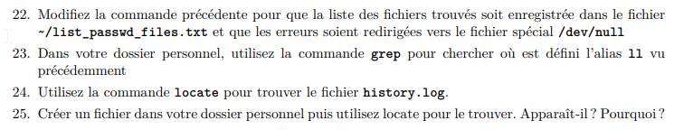
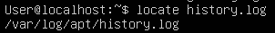

MOREL Loïc

#
 TP1 - Linux Ubuntu

Installation d’Ubuntu Server et prise en main du shell - CPE Lyon - 4ETI, 3IRC & 3ICS - Année 2022/2023 Administration Système

##Exercice 2
###Manuel

1) La commande which permet de localiser le binaire d'une commande
1) Il faut écrire « /paterne » pour chercher un text
1) Il faut écrire « q » pour quitter
1) La première page de la section 6 concerne les jeux, économiseurs d’écran, gadgets...

###Navigation

1) 
1) 
1) 
1) 
1) Je n’ai pas la permission d’accéder au dossier

1) Ça permet d’accédé au dossier en effet sudo permet de lancer la commande avec de privilège plus élever

8) On ne peut pas supprimer le dossier 

9) On utilise la command rm –d pour supprimer un dossier

10) On peut pas supprimer le dossier car il n’est pas vide
11) Il faut utiliser la command rm -r

###Commandes importantes

1) La commande pour lire l’heure est date

La commande time permet de savoir en combien de temps la commande c’est exécuter

2) Le fichier qui commence par un « . » sont des fichier cachée

3) La commande « ls » ce situe dans /usr/bin/ls

4) Cette commande n’est pas dans le man car c’est un alias, Ajoute la possibilité de voir les permissions

5) La commande « ls /bin » permet d’afficher le contenue de « /bin »
6) La commande « ls .. » permet d’afficher le contenue du répertoire précèdent
7) La commande « pwd » donne le chemin complet du dossier courant

8) La commande « > » écrit ‘bip’ dans le fichier plop en écrasants le précèdent

9) La command « >> » ecrit ‘bip’ en fin du fichier

10) Le programme attend 10 seconde avant d’afficher ‘toto’

11) Le permet de savoir si c’est un fichier ou un dossier

12) On observe que le fichier lien\_phy est liée au fichier original

Si on supprime le ficher original cela n’a pas d’importance pour le fichier lien\_phy

13) Le deux fichier sont synchroniser si on modifier un des deux fichiers l’autre est aussi modifier, si on supprime le fichier le lien symbolique ne fonctionne plus

14) La commande est « tail –F /var/log/syslog », pour arrêter « ctl+s » pour reprendre « ctl+q »

Il faut utiliser la commande « head –Nx /var/log/syslog » permet d’afficher x première ligne du fichier

Il faut utiliser la commande « tail –Nx /var/log/syslog » permet d’afficher x dernière ligne du fichier
15) 

16) La commande « dmesg | less » permet d’afficher page par page

17) Le dossier « /etc/passwd » permet de voir les utilisateurs, leur id et leur id group et où se situe son répertoire personnel et le chemin absolu du shell

18) On utilise la command « awk –F ‘ :’ ‘{print $1}’ /etc/passwd | sort –r » 

19) La commande « wc » permet de savoir le nombre de ligne dans un fichier
20) 

21) La commande qui permet de trouvée tous les fichiers se nommant passwd présents sur la machine est « find / -name « passwd »

22) A
23) La commande locate ne returne rien

A

24) Le fichier n’apparait pas

